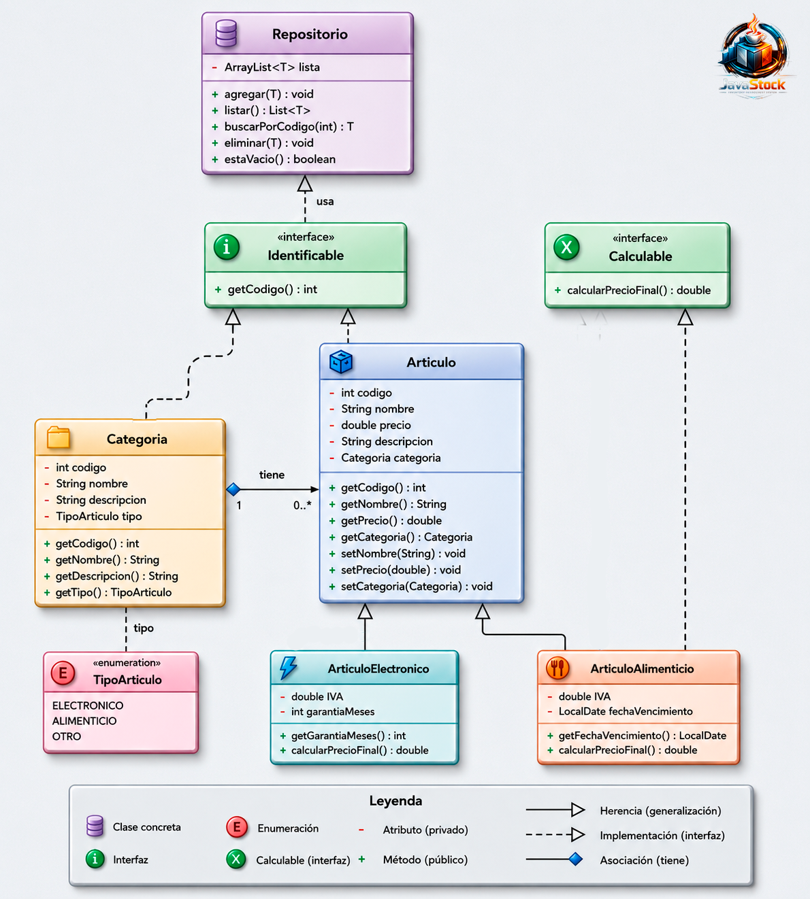
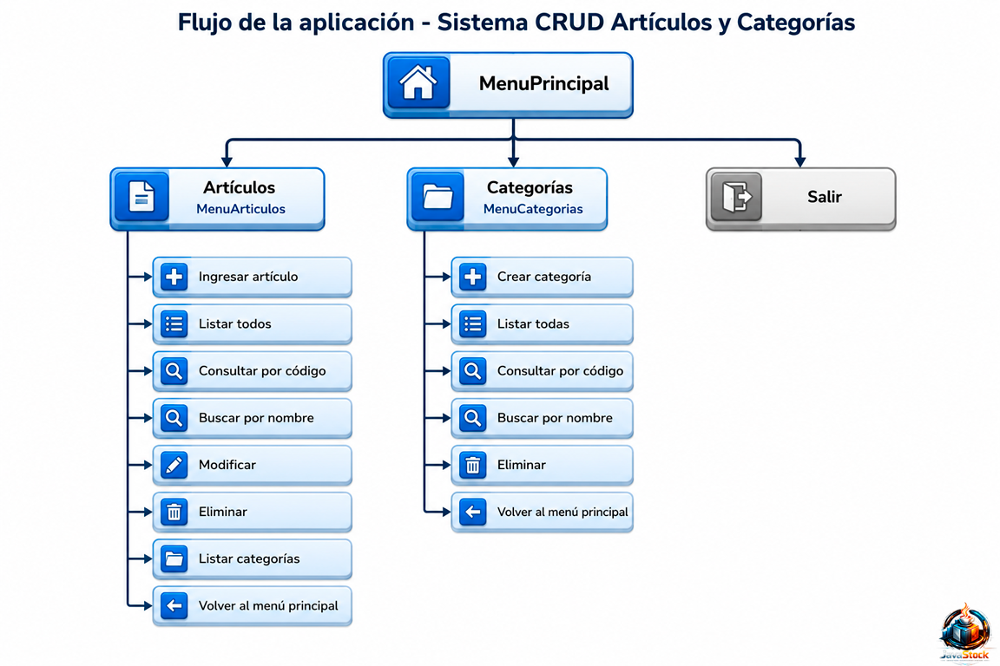
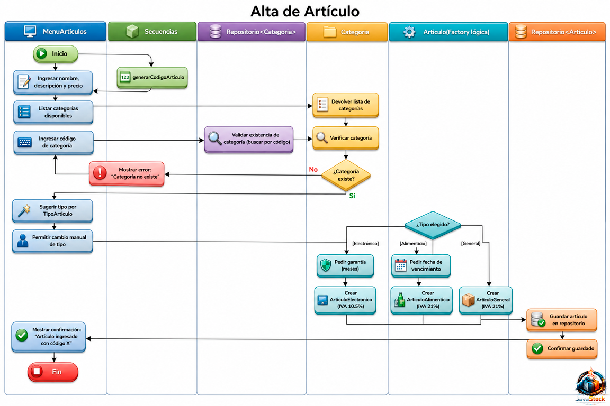
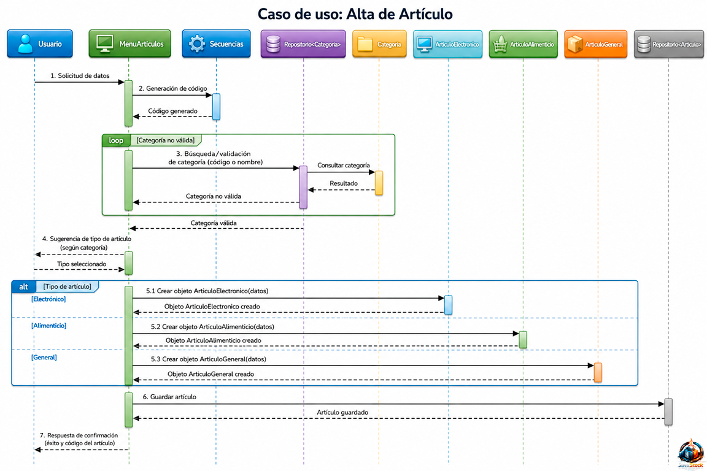
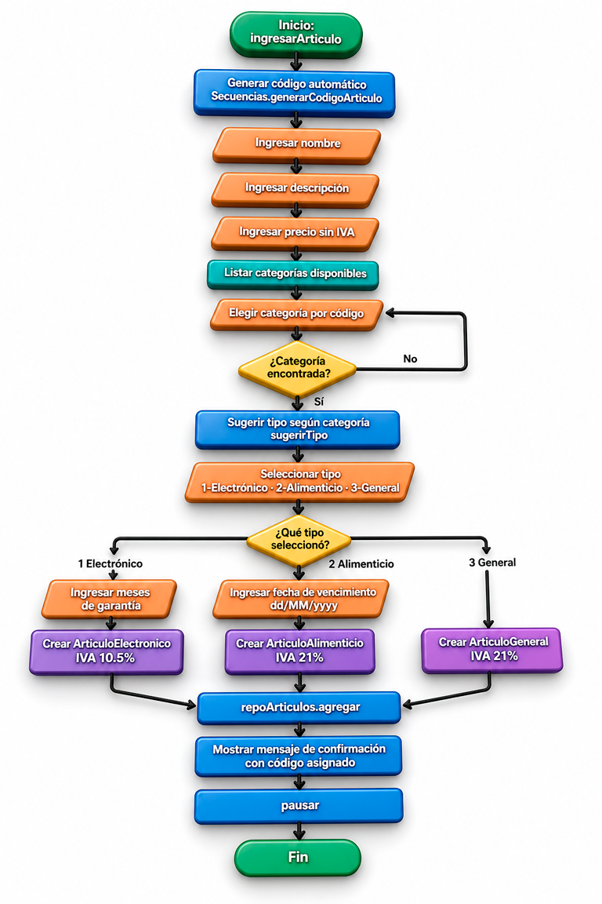

<div align="center">
  

  # 🗂️ **Sistema CRUD — Artículos y Categorías**

  <!-- Badges -->
  <p>
    
    
    
    
  </p>

</div>


<table>
  <tr>
    <td valign="middle"></td>
    <td valign="middle">
      Sistema de gestión de artículos y categorías desarrollado en Java puro (sin frameworks). <br>
      Aplica principios de <strong>Programación Orientada a Objetos</strong>: herencia, abstracción, interfaces genéricas y el patrón Repositorio.
    </td>
  </tr>
</table>

---

## ✨ Características

- ✅ CRUD completo de **Artículos** (crear, listar, consultar, buscar, modificar, eliminar)
- ✅ CRUD completo de **Categorías**
- ✅ Subtipado de artículos: **Electrónico** (IVA 10.5%, garantía en meses) y **Alimenticio** (IVA 21%, fecha de vencimiento)
- ✅ Cálculo de precio final con IVA aplicado al listar (polimorfismo via `Calculable`)
- ✅ Búsqueda parcial por nombre (contiene texto)
- ✅ Generación automática de códigos secuenciales
- ✅ Validaciones de entrada reutilizables
- ✅ Menús interactivos con limpieza de pantalla y pausas
- ✅ 4 categorías precargadas al inicio
- ✅ Repositorio genérico en memoria

---

## 🏗️ Arquitectura

```
src/
├── Main.java                              # Punto de entrada
└── com/techlab/articulos/
    ├── interfaces/
    │   ├── Identificable.java             # Contrato: int getCodigo()
    │   └── Calculable.java                # Contrato: calcularPrecioFinal()
    ├── model/
    │   ├── TipoArticulo.java              # Enum: ELECTRONICO, ALIMENTICIO, OTRO
    │   ├── Categoria.java                 # Modelo: código, nombre, descripción, tipo
    │   ├── Articulo.java                  # Modelo base: código, nombre, precio, descripción, categoría
    │   ├── ArticuloAlimenticio.java       # Subtipo: implements Calculable — IVA 21%, fecha de vencimiento
    │   ├── ArticuloElectronico.java       # Subtipo: implements Calculable — IVA 10.5%, garantía en meses
    │   └── ArticuloGeneral.java           # Subtipo: implements Calculable — IVA 21%, sin campos adicionales
    ├── repository/
    │   └── Repositorio.java               # Repositorio genérico <T extends Identificable>
    ├── menu/
    │   ├── Menu.java                      # Clase abstracta base para todos los menús
    │   ├── MenuPrincipal.java             # Menú raíz: rutea a Artículos o Categorías
    │   ├── MenuArticulos.java             # CRUD de artículos
    │   └── MenuCategorias.java            # CRUD de categorías
    └── utils/
        ├── Secuencias.java                # Generador de códigos auto-incrementales
        └── Validaciones.java              # Validadores estáticos reutilizables
```

---

## 🧩 Descripción de clases principales

### `Menu` (abstracta)
Base de todos los menús. Encapsula el `Scanner` compartido y expone métodos de utilidad:

| Método | Descripción |
|---|---|
| `imprimirMenu(titulo, opciones[])` | Renderiza el menú con separadores |
| `leerEntero(mensaje)` | Lee y valida un entero |
| `leerDouble(mensaje)` | Lee y valida un decimal no negativo |
| `leerTexto(mensaje)` | Lee un texto no vacío |
| `leerSiNo(mensaje)` | Lee confirmación s/n |
| `leerFecha(mensaje)` | Lee y valida una fecha en formato `dd/MM/yyyy` |
| `leerTextoConDefault(mensaje, default)` | Lee texto; si el usuario presiona Enter sin escribir, devuelve el valor por defecto |
| `limpiarPantalla()` | Limpia la consola |
| `pausar()` | Espera Enter del usuario |

### `Articulo` y sus subtipos
`Articulo` es la clase base. Al crear un artículo se elige el tipo:

| Subtipo | IVA | Campo adicional | `calcularPrecioFinal()` |
|---|---|---|---|
| `ArticuloElectronico` | 10.5% | `garantiaMeses` (int) — meses de garantía | `precio * 1.105` |
| `ArticuloAlimenticio` | 21% | `fechaVencimiento` (LocalDate) — fecha de vencimiento | `precio * 1.21` |
| `ArticuloGeneral` | 21% | — ninguno | `precio * 1.21` |

Al listar, el polimorfismo invoca automáticamente el `toString()` del subtipo correcto, mostrando el precio final con IVA incluido, junto con el campo específico del subtipo.

### `Categoria`
Modelo con campos: `codigo`, `nombre`, `descripcion` y `tipo` (`TipoArticulo`). El tipo determina qué clase de artículo corresponde a esa categoría, y se usa para pre-seleccionar el tipo al dar de alta un artículo.

### `TipoArticulo`
Enum con tres valores: `ELECTRONICO`, `ALIMENTICIO`, `OTRO`. Pertenece a `Categoria` y permite que el alta de artículos sugiera automáticamente el subtipo correcto según la categoría elegida.

### `Calculable`
Interfaz con un único método `double calcularPrecioFinal()`. Implementada por `ArticuloElectronico`, `ArticuloAlimenticio` y `ArticuloGeneral` con lógicas propias.

### `Identificable`
Interfaz con `int getCodigo()`. Implementada por `Articulo` y `Categoria`. Es el contrato que exige el repositorio genérico.

### `Repositorio<T extends Identificable>`
Almacenamiento en memoria con métodos: `agregar`, `listar`, `buscarPorCodigo`, `eliminar`, `estaVacio`.

### `Secuencias`
Clase utilitaria final con contadores estáticos. Genera códigos únicos para artículos y categorías automáticamente.

### `Validaciones`
Clase utilitaria final con validadores estáticos: `textoNoVacio`, `longitudMaxima`, `noNegativo` (para `int` y `double`).

---

## ⚙️ Requisitos

- **JDK 17** o superior
- No requiere frameworks ni dependencias externas

---

## 🔨 Compilación

Desde la raíz del proyecto:

```bash
javac -encoding UTF-8 -d bin src/Main.java src/com/techlab/articulos/**/*.java src/com/techlab/articulos/menu/*.java src/com/techlab/articulos/model/*.java src/com/techlab/articulos/repository/*.java src/com/techlab/articulos/interfaces/*.java src/com/techlab/articulos/utils/*.java
```

O usando la tarea de VS Code:

> **Terminal → Ejecutar tarea → Compilar Java**

---

## ▶️ Ejecución

```bash
java -cp bin Main
```

O usando la tarea de VS Code:

> **Terminal → Ejecutar tarea → Ejecutar Java**

---

## �🗺️ UML:

## Diagrama de clases


<div align="center">
  
</div>


---

## �🧭 Flujo de Navegación de la aplicación

```
MenuPrincipal
├── 1. Artículos  →  MenuArticulos
│       ├── 1. Ingresar artículo
│       ├── 2. Listar todos
│       ├── 3. Consultar por código
│       ├── 4. Buscar por nombre
│       ├── 5. Modificar
│       ├── 6. Eliminar
│       ├── 7. Listar categorías
│       └── 0. Volver al menú principal
├── 2. Categorías →  MenuCategorias
│       ├── 1. Crear categoría
│       ├── 2. Listar todas
│       ├── 3. Consultar por código
│       ├── 4. Buscar por nombre
│       ├── 5. Eliminar
│       └── 0. Volver al menú principal
└── 0. Salir
```
<div align="center">
  
</div>

---

## 🛤️ Diagrama de Actividad con Swimlanes
- muestra flujo lógico del proceso y decisiones.

<div align="center">
  
</div>

---

## 📡 Diagrama de Diagrama de Secuencia UML para el caso de uso: Alta de producto
- muestra interacción temporal entre objetos/clases (mensajes en orden cronológico)

<div align="center">
  
</div>

---

## 🔄 Diagrama de control Alta de Producto: MenuArticulos.ingresarArticulo()

<div align="center">
  
</div>


### 📌 El flujo clave es:

> 1. El código del producto se genera automáticamente; no lo ingresa el usuario. (MenuArticulos.java)
> 2. La categoría se selecciona entre las categorías disponibles del sistema y se valida que exista. 
> 3. Según la categoría, se sugiere un tipo de artículo (Electrónico, Alimenticio o General), pero el usuario puede cambiar esa sugerencia.
> 4. El tipo elegido define los campos adicionales del alta:
>    - Electrónico: garantía en meses.
>    - Alimenticio: fecha de vencimiento.
>    - General: sin campos extra.
> 5. Cada subtipo calcula su precio final aplicando su IVA cuando se invoca el cálculo:
>    - Electrónico: 10.5%.
>    - Alimenticio: 21%.
>    - General: 21%.

### 🧩 Clases involucradas en el alta

- `MenuArticulos`: orquesta el flujo de ingreso y validaciones.
- `Secuencias`: genera el código automático del artículo.
- `Categoria`: representa la categoría elegida por el usuario.
- `TipoArticulo`: enum que permite sugerir el tipo según la categoría.
- `Articulo`: clase base del producto.
- `ArticuloElectronico`: subtipo con garantía e IVA 10.5%.
- `ArticuloAlimenticio`: subtipo con fecha de vencimiento e IVA 21%.
- `ArticuloGeneral`: subtipo sin campos extra e IVA 21%.
- `Calculable`: contrato común para calcular el precio final (no se guarda, siempre se calcula en tiempo real).

---
<a id="doc"></a>
## 📚 Documentación

| Documento | Descripción |
|---|---|
| [Patrón Repository](./docs/patron-repository.md) | Explicación del patrón Repository aplicado en este proyecto |
| [Interfaces del proyecto](./docs/interfaces.md) | Detalle de las interfaces `Identificable` y `Calculable` |
| [Polimorfismo en el listado](./docs/polimorfismo.md) | Cómo funciona el polimorfismo con los distintos tipos de artículos (ArticuloElectronico, ArticuloAlimenticio, ArticuloGeneral) en la opción Listar artículos |

---
## 👤 Autor: G.Escobar

Proyecto educativo desarrollado para **Talento Tech — Curso Java · 1° cuatrimestre 2026**.

**Profe:** Gisele  Milagros Gonzalez

Repositorio: [DevAuxi-Arg/TalentoJava1c26](https://github.com/DevAuxi-Arg/TalentoJava1c26)

---

## 📚 Manuales y documentación desarrollados por Gise

| Tipo | Archivo | Descripción |
|---|---|---|
| ☕ | [Introducción a Java](./docs/manuales/Manual_Introductorio_de_Java.docx) | Conceptos básicos e introducción al lenguaje Java |
| ⚙️ | [Instalación de Java](./docs/manuales/Manual_de_Instalación_y_Primer_Programa_en_Java_con_Visual_Studio_Code.pdf) | Configuración del entorno y primeros pasos con Visual Studio Code |
| 💻 | [Primer proyecto en Java](./docs/manuales/Manual_de_Instalación_y_Primer_Programa_en_Java_con_Visual_Studio_Code.pdf) | Desarrollo de una primera aplicación en Java utilizando VSC |
| 🗂️ | [CRUDs del proyecto](./docs/manuales/Manual_Java_Poo_CRUDS_EXPLICADOS_EN_DETALLE.pdf) | Explicación detallada de operaciones CRUD aplicadas en Java POO |
| 🏗️ | [Manual técnico y arquitectura](./docs/manuales/Diagrama_Y_Manual_Arquitectura_Preentrega_Java_260508.pdf) | Diagramas, estructura y arquitectura general del sistema |


---

## 🧑‍💻 **SOBRE EL DESARROLLADOR**

<div align="center">


### 👨‍🚀 **WILLY ESCOBAR**
*Software Engineer | UI/UX Designer | STEAM Creator blending Software Engineering and Visual Arts*

<br>


<br>

> *"Cada clase cuenta una historia de diseño, escalabilidad y aprendizaje."*

<br>