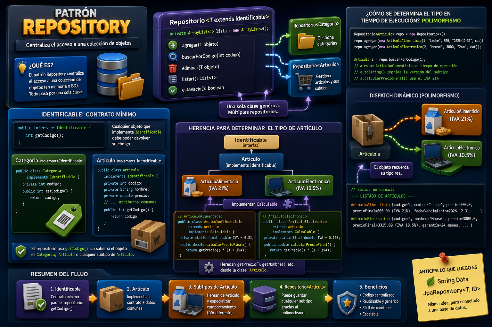

# Patrón Repository

## ¿Qué es?

El patrón Repository centraliza el acceso a una colección de objetos en memoria (o base de datos). En lugar de esparcir lógica de búsqueda/guardado por todo el código, todo pasa por una sola clase.

---

## Implementación en este proyecto

`Repositorio.java` es **genérico**:

```java
public class Repositorio<T extends Identificable> {
    private ArrayList<T> lista = new ArrayList<>();

    public void agregar(T objeto) { ... }
    public T buscarPorCodigo(int codigo) { ... }  // usa getCodigo() de Identificable
    public void eliminar(T objeto) { ... }
    public List<T> listar() { ... }
    public boolean estaVacio() { ... }
}
```

Con una sola clase se puede tener:
- `Repositorio<Categoria>` — gestiona categorías
- `Repositorio<Articulo>` — gestiona artículos (y sus subtipos)

Esto anticipa lo que luego es `JpaRepository<T, ID>` en Spring Boot.

---

## Cómo se implementa `Identificable`

La interfaz define un único contrato: cualquier objeto que la implemente debe poder devolver su código.

```java
public interface Identificable {
    int getCodigo();
}
```

Tanto `Categoria` como `Articulo` la implementan directamente:

```java
public class Categoria implements Identificable {
    public int getCodigo() { return codigo; }
}

public class Articulo implements Identificable {
    public int getCodigo() { return codigo; }
}
```

Esto le permite al repositorio usar `elemento.getCodigo()` en `buscarPorCodigo()` sin importar si el objeto es una `Categoria`, un `Articulo`, o un subtipo de `Articulo`.

---

## Herencia para determinar el tipo de artículo

La cadena de herencia es la siguiente:

```
Identificable  (interfaz)
      ↑
   Articulo     (implements Identificable → tiene getCodigo())
      ↑
  ┌───────────────────────┐
  │                       │
ArticuloAlimenticio   ArticuloElectronico
(IVA 21%)             (IVA 10.5%)
```

Ambas subclases extienden `Articulo` y agregan comportamiento específico mediante `Calculable`:

```java
// ArticuloAlimenticio
public class ArticuloAlimenticio extends Articulo implements Calculable {
    private static final double IVA = 0.21;

    public double calcularPrecioFinal() {
        return getPrecio() * (1 + IVA);  // hereda getPrecio() de Articulo
    }
}

// ArticuloElectronico
public class ArticuloElectronico extends Articulo implements Calculable {
    private static final double IVA = 0.105;

    public double calcularPrecioFinal() {
        return getPrecio() * (1 + IVA);
    }
}
```

### ¿Cómo se determina el tipo en tiempo de ejecución?

Por **polimorfismo**:

```java
Repositorio<Articulo> repo = new Repositorio<>();
repo.agregar(new ArticuloAlimenticio(1, "Leche", 500, "...", cat));
repo.agregar(new ArticuloElectronico(2, "Mouse", 3000, "...", cat));

Articulo a = repo.buscarPorCodigo(1);
// a es un ArticuloAlimenticio en tiempo de ejecución
// a.toString() imprime "ArticuloAlimenticio { ... (IVA 21%) }"
```

El repositorio trabaja con el tipo base `Articulo`, pero cada objeto recuerda su tipo real. Cuando se llama `toString()` o `calcularPrecioFinal()`, Java ejecuta la versión del subtipo concreto — eso es **dispatch dinámico**.

---
## 🔄 Infografía sobre el patrón Repositoryen del proyecto 

<div align="center">
  
</div>

---
## Resumen del flujo

1. `Identificable` → contrato mínimo para el repositorio (`getCodigo()`)
2. `Articulo` → implementa ese contrato + datos comunes
3. `ArticuloAlimenticio` / `ArticuloElectronico` → heredan de `Articulo` y especializan comportamiento (IVA diferente)
4. `Repositorio<Articulo>` → puede guardar cualquier subtipo gracias al polimorfismo

---

[← Volver al README](../README.md#doc)
